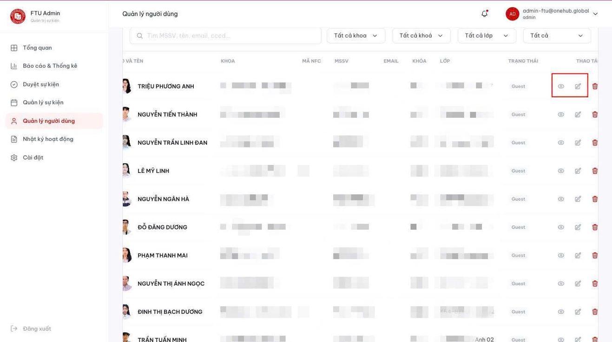

# Quản lý người dùng

Màn hình **Quản lý người dùng** hiển thị toàn bộ người dùng của trường, chia theo 3 tab: **Sinh viên FTU**, **Giảng viên**, **Sinh viên ngoại quốc**. Admin trường có thể lọc theo khoa / khóa / trạng thái, hoặc tìm kiếm theo tên, MSSV, email.

## PHẦN 1 — HỒ SƠ NGƯỜI DÙNG

### Bước 1: Mở hồ sơ

Bấm biểu tượng con mắt (xem) hoặc bút chì (sửa) trên hàng người dùng.

<figure><figcaption></figcaption></figure>

## Xem và chỉnh sửa hồ sơ

1. Trên hàng người dùng cần thao tác, bấm biểu tượng **con mắt** để xem hoặc biểu tượng **bút chì** để sửa, nhằm mở hồ sơ chi tiết.
2. Xem hoặc chỉnh sửa các thông tin: họ tên, email, khoa, khóa.
3. Quản lý thẻ NFC của người dùng: gắn mã thẻ (UID hệ 16, từ 6–16 ký tự) hoặc thu hồi thẻ đang gắn.

## Lưu ý

* Mã UID thẻ NFC phải đúng hệ 16 (hexadecimal) và có độ dài từ 6 đến 16 ký tự; hệ thống sẽ báo lỗi nếu nhập sai định dạng.
* Thu hồi thẻ sẽ vô hiệu hóa thẻ NFC hiện tại của người dùng; cần gắn lại mã thẻ mới nếu người dùng được cấp thẻ khác.
* Với thao tác thêm/xóa hàng loạt người dùng, xem [Import danh sách](import-danh-sach.md) và [Xóa người dùng](xoa-nguoi-dung.md).
