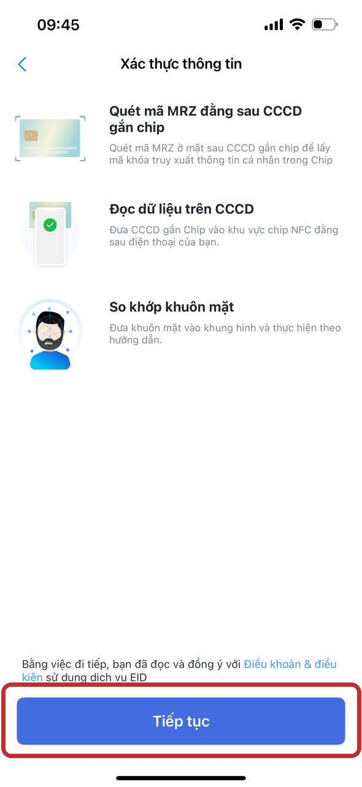
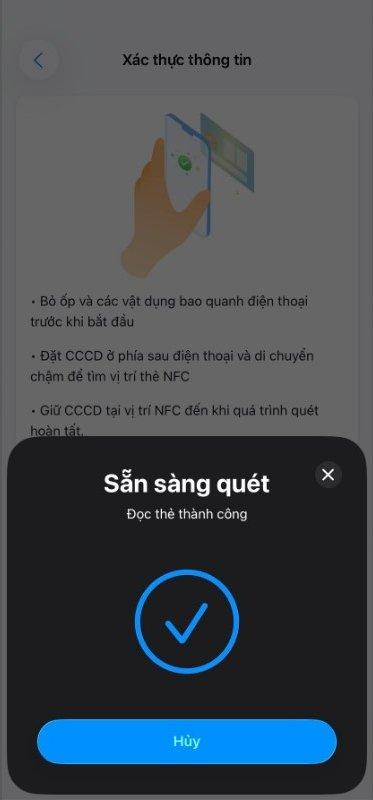
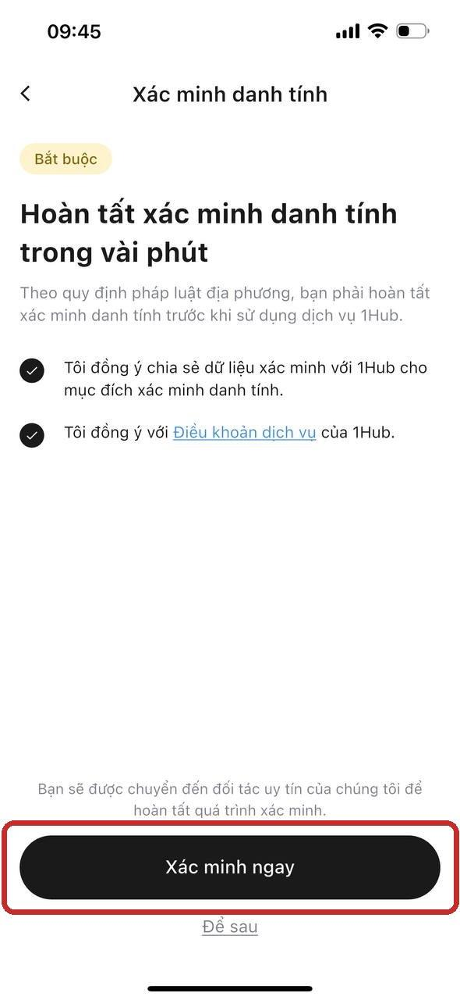
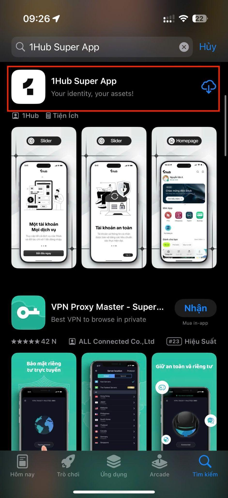
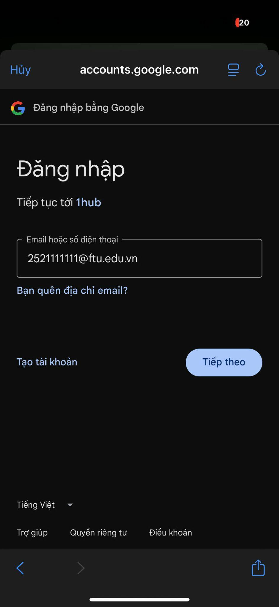

# Cài đặt, đăng nhập và xác minh danh tính

Hướng dẫn này áp dụng cho sinh viên, giảng viên và thành viên Ban tổ chức.

## 1. Cài đặt 1Hub Super App

1. Mở **CH Play** hoặc **App Store**.
2. Tìm **1Hub Super App**.
3. Cài đặt ứng dụng.

## 2. Cấp quyền cho ứng dụng

Khi mở ứng dụng lần đầu, cho phép các quyền cần thiết:

- Internet.
- Camera.
- NFC.
- Thông báo.

## 3. Đăng nhập

1. Chọn **Tiếp tục với Email**, **Tiếp tục với Google** hoặc **Apple**.
2. Nhập email do Nhà trường cấp có tên miền `@ftu.edu.vn`.
3. Nhập mã OTP được gửi về email. Mã có hiệu lực trong 5 phút.
4. Sau khi xác thực thành công, ứng dụng mở màn hình Trang chủ của 1Hub.

> Tài khoản 1Hub không sử dụng mật khẩu theo luồng này. Nếu chưa có tài khoản, hệ thống sẽ tạo tài khoản trong quá trình đăng nhập.

## 4. Xác minh danh tính eKYC

### Chuẩn bị

- CCCD gắn chip.
- Điện thoại có NFC.
- Kết nối Internet ổn định.

Khi chưa hoàn tất xác minh, Mini App FTU có thể hiển thị biểu tượng khóa.

### Các bước thực hiện

1. Tại Trang chủ 1Hub, nhấn **Xác minh ngay** trên banner cảnh báo.
2. Tích chọn các điều khoản đồng ý cần thiết và tiếp tục.
3. Xem hướng dẫn xác thực, sau đó nhấn **Tiếp tục**.
4. Quét mã MRZ ở mặt sau CCCD.
5. Đưa CCCD vào vùng NFC ở mặt sau điện thoại và giữ yên vài giây.
6. Đưa khuôn mặt vào khung hình và làm theo hướng dẫn.

## Kết quả

Sau khi xác minh thành công:

- Tài khoản chuyển sang trạng thái đã xác minh.
- Mini App FTU được mở khóa.
- Hệ thống nhận diện vai trò dựa trên email và danh sách Nhà trường cung cấp.

> Nếu hệ thống nhận diện sai vai trò hoặc không mở được Mini App, liên hệ Phòng Công tác sinh viên để đối chiếu danh sách.
