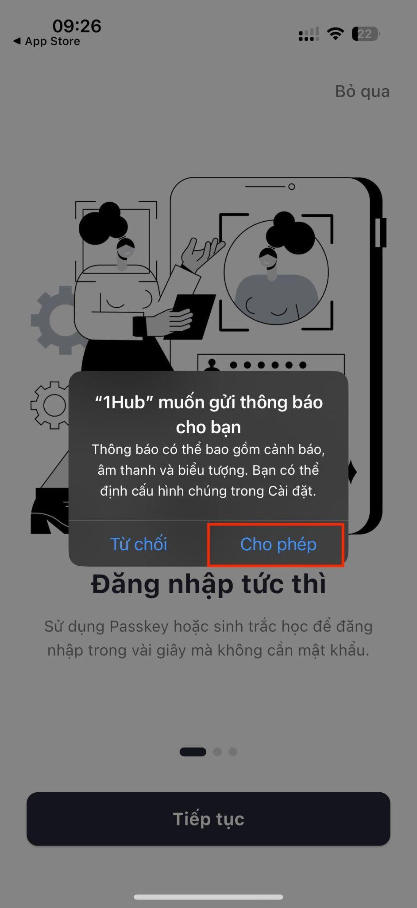
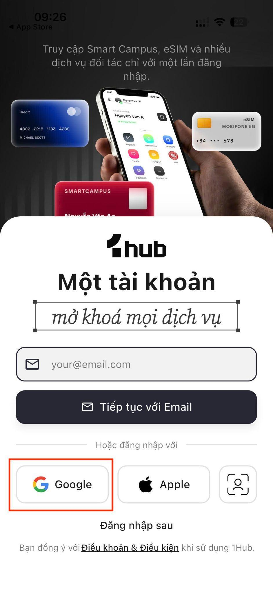
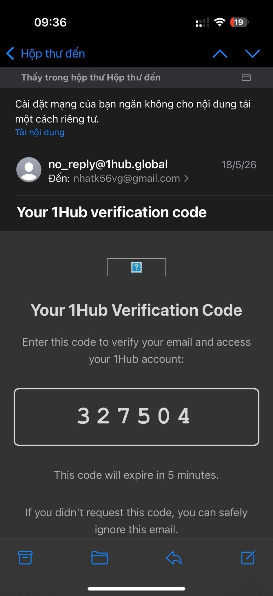
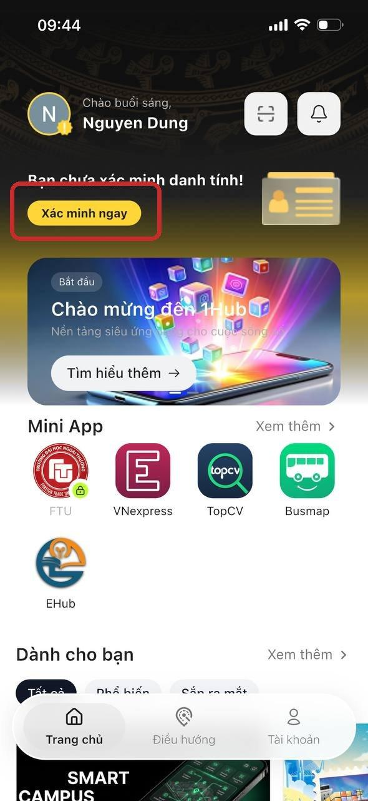
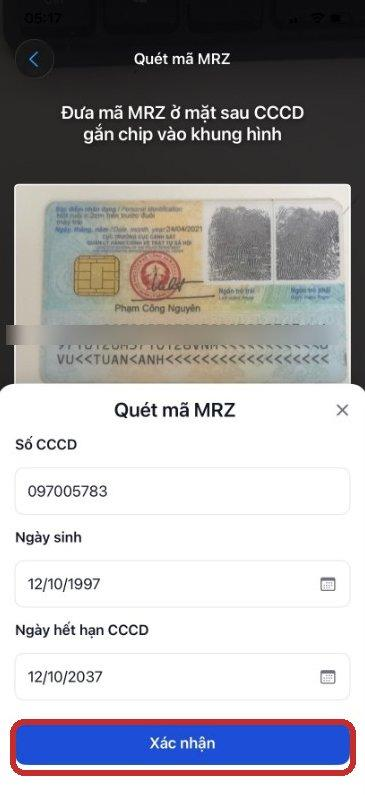
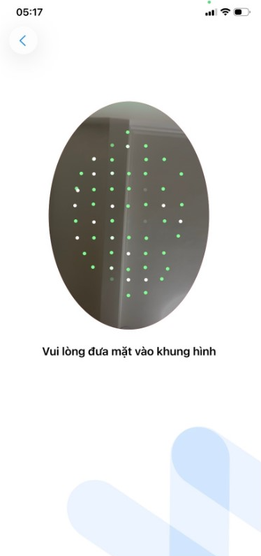

# Cài đặt, đăng nhập và eKYC

Hướng dẫn này áp dụng cho sinh viên, giảng viên và thành viên Ban tổ chức.

## 1. Cài đặt 1Hub Super App

1. Mở **CH Play** hoặc **App Store**.
2. Tìm **1Hub Super App và cài đặt ứng dụng**

## 2. Cấp quyền cho ứng dụng

Khi mở ứng dụng lần đầu, cho phép các quyền cần thiết:

* Internet.
* Camera.
* NFC.
* Thông báo.

## 3. Đăng nhập

1. Chọn **Tiếp tục với Email**, **Tiếp tục với Google** hoặc **Apple**.

2. Nhập email do Nhà trường cấp có tên miền `@ftu.edu.vn`.

3. Nhập mã OTP được gửi về email. Mã có hiệu lực trong 5 phút.

4. Sau khi xác thực thành công, ứng dụng mở màn hình Trang chủ của 1Hub.

> Tài khoản 1Hub không sử dụng mật khẩu theo luồng này. Nếu chưa có tài khoản, hệ thống sẽ tạo tài khoản trong quá trình đăng nhập.

## 4. Xác minh danh tính eKYC

### Chuẩn bị

* CCCD gắn chip.
* Điện thoại có NFC.
* Kết nối Internet ổn định.

Khi chưa hoàn tất xác minh, Mini App FTU có thể hiển thị biểu tượng khóa.

### Các bước thực hiện

1. Tại Trang chủ 1Hub, nhấn **Xác minh ngay** trên banner cảnh báo.

2. Tích chọn các điều khoản đồng ý cần thiết và tiếp tục.

2. Xem hướng dẫn xác thực, sau đó nhấn **Tiếp tục**.

2. Quét mã MRZ ở mặt sau CCCD.

2. Đưa CCCD vào vùng NFC ở mặt sau điện thoại và giữ yên vài giây.

2. Đưa khuôn mặt vào khung hình và làm theo hướng dẫn.

## Kết quả

Sau khi xác minh thành công:

* Tài khoản chuyển sang trạng thái đã xác minh.
* Mini App FTU được mở khóa.
* Hệ thống nhận diện vai trò dựa trên email và danh sách Nhà trường cung cấp.

> Nếu hệ thống nhận diện sai vai trò hoặc không mở được Mini App, liên hệ Phòng Công tác sinh viên để đối chiếu danh sách.
