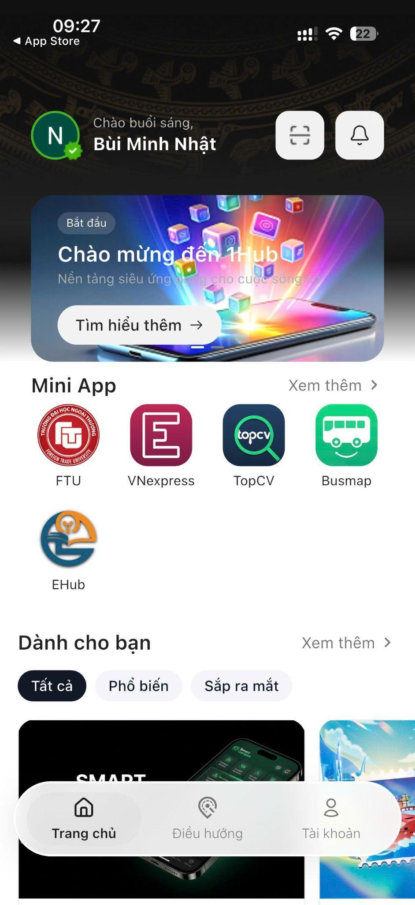

# Mở Mini App FTU

## Cách mở

1. Đăng nhập vào ứng dụng 1Hub.

2. Tại Trang chủ, tìm khu vực **Mini App** và chạm biểu tượng **FTU**.

## Không thấy hoặc không mở được Mini App

Kiểm tra lần lượt:

* Đã dùng đúng email Nhà trường cấp chưa.
* Đã hoàn tất eKYC chưa.
* Ứng dụng đã được cập nhật lên phiên bản mới nhất chưa.
* Hệ thống đã nhận diện đúng vai trò chưa.

Xem thêm: [Xử lý sự cố](../ho-tro/xu-ly-su-co.md).
