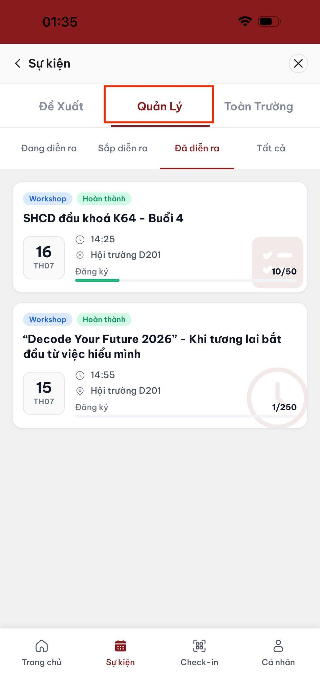
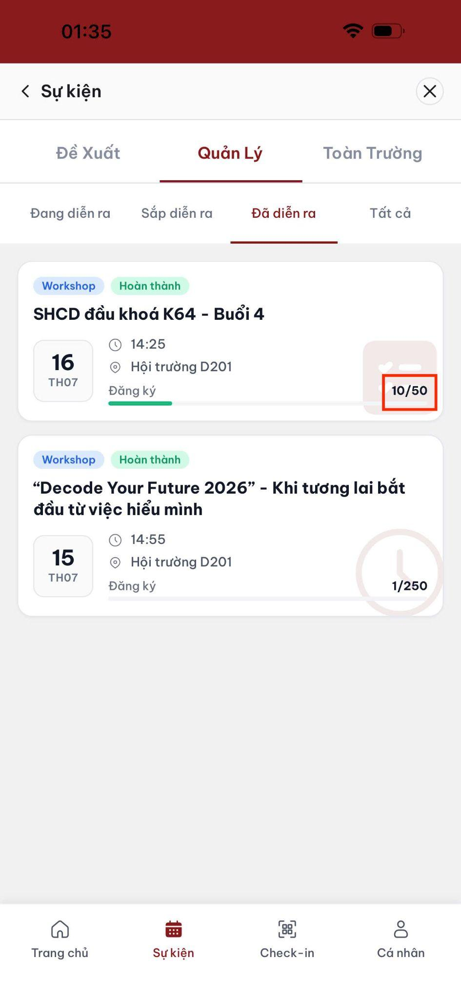
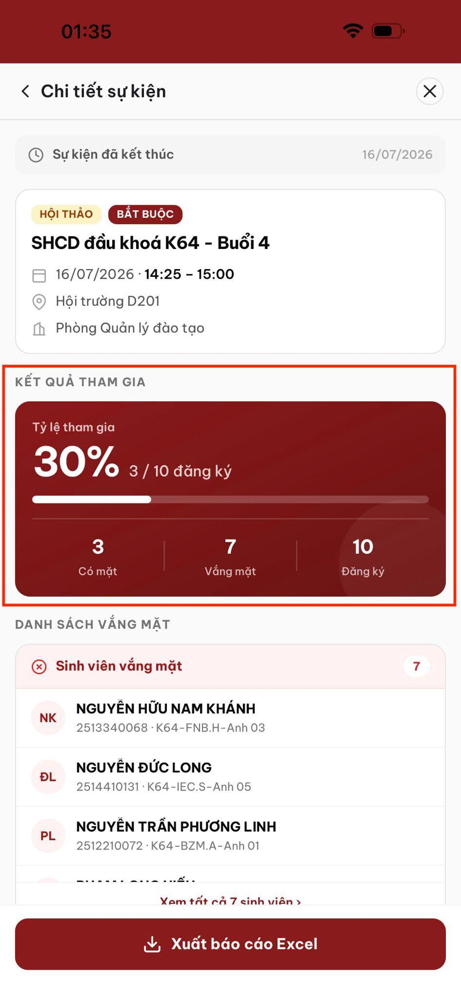
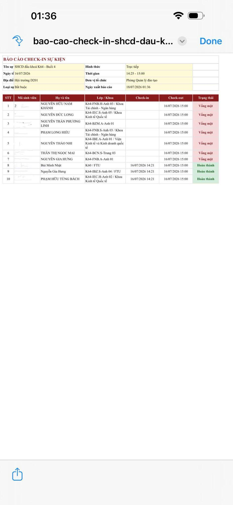

# Xem báo cáo và xuất Excel

## Xem báo cáo

1. Vào tab **Quản lý**.

2. Chọn sự kiện.
3. Xem tổng số sinh viên đã đăng ký.

4. Xem danh sách đã check-in và chưa check-in.

## Xuất Excel

Nhấn nút xuất Excel để tải danh sách đăng ký/điểm danh.

Tệp Excel có thể bao gồm:

* Danh sách sinh viên đăng ký.
* Trạng thái check-in của từng sinh viên.
* Thời gian check-in.

## Kiểm tra trước khi sử dụng báo cáo

* Đối chiếu tổng số trên màn hình với số dòng trong tệp.
* Kiểm tra trường hợp check-in thủ công hoặc ghi đè.
* Lưu tệp theo quy tắc quản lý dữ liệu của Nhà trường.
