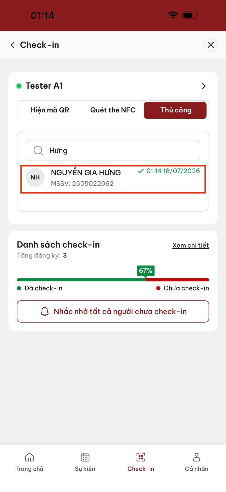
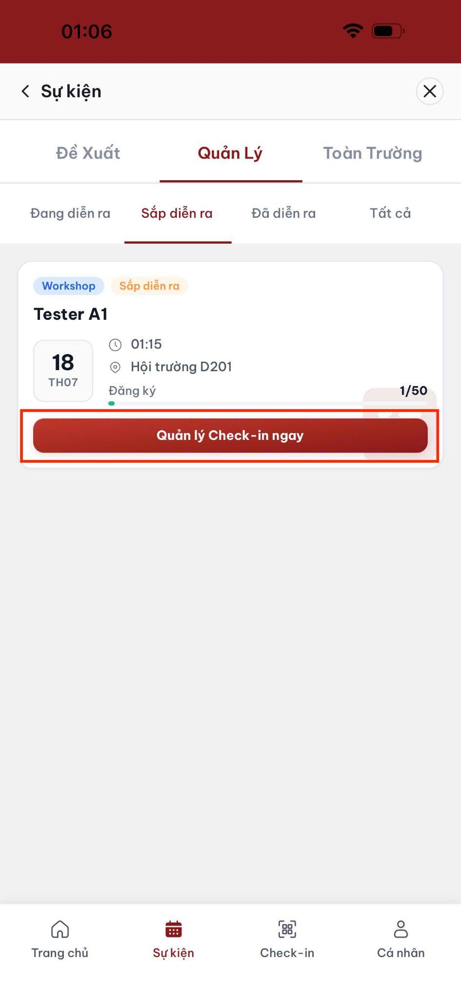
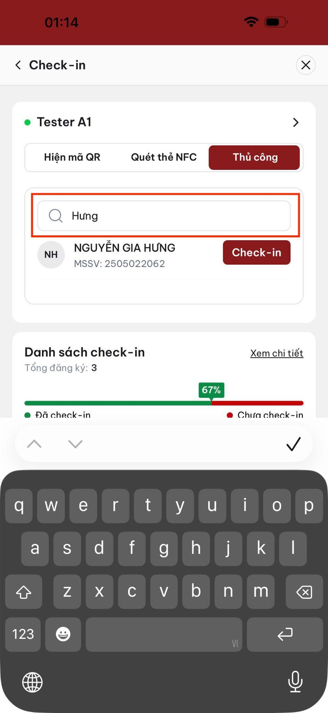
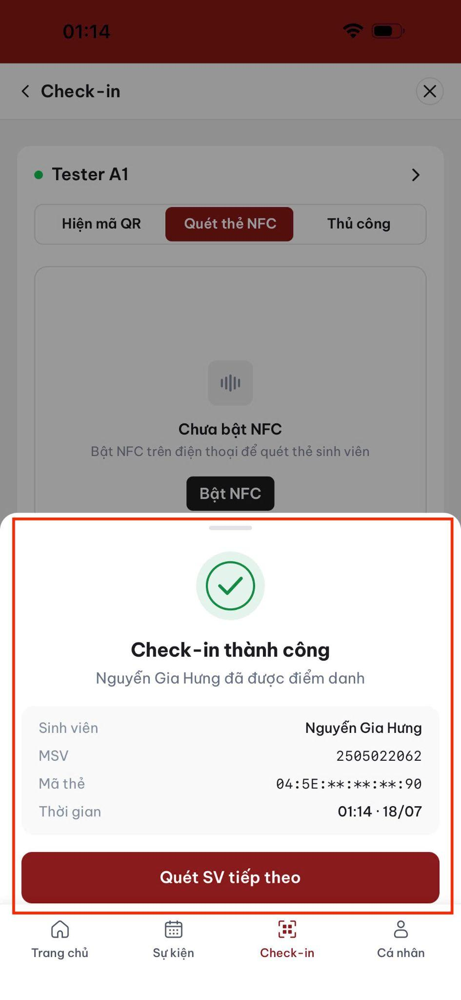
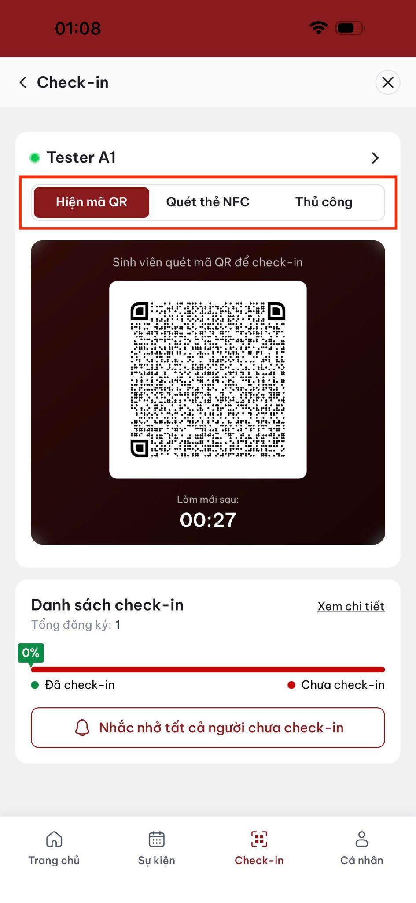
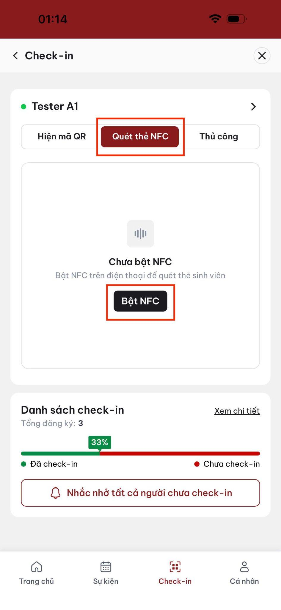
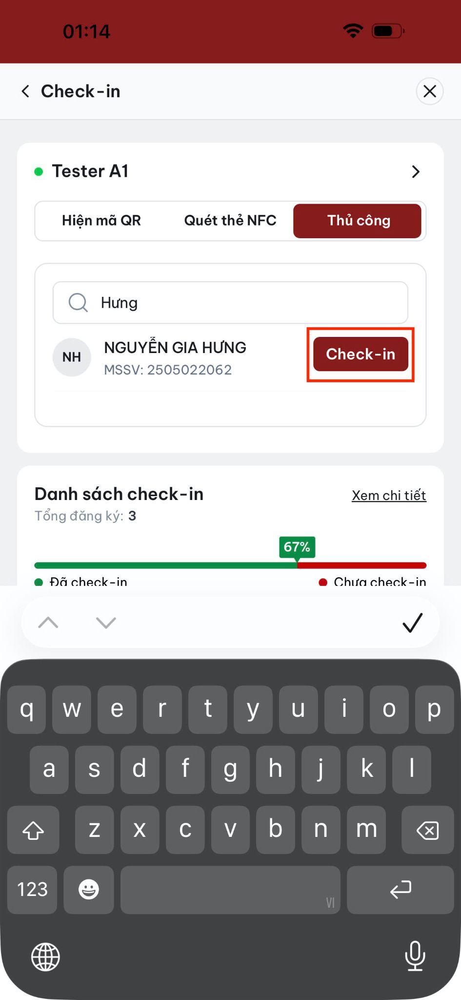
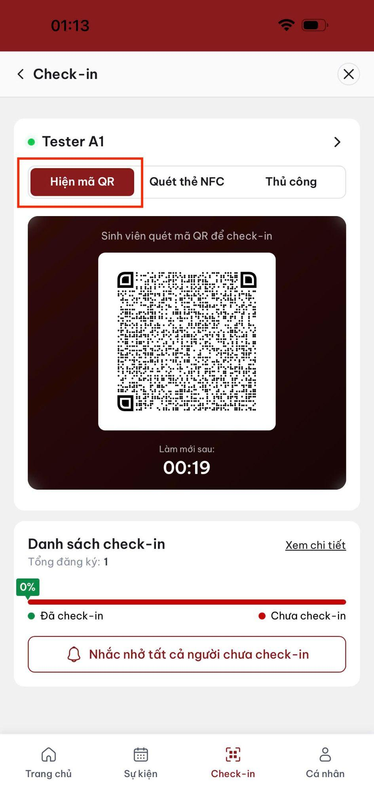

# Điểm danh tại sự kiện

Giảng viên hoặc BTC nên mở chế độ điểm danh trước giờ bắt đầu khoảng 15 phút.

## Bắt đầu

1. Vào **Quản lý**.
2. Chọn sự kiện đang diễn ra.
3. Nhấn **Quản lý Check-in ngay**.
4. Chọn một trong ba tab: **Hiện mã QR**, **Quét thẻ NFC**, **Thủ công**.

## Phương thức 1: Mã QR

Phù hợp với sự kiện đông sinh viên và có màn hình lớn.

1. Chọn **Hiện mã QR**.
2. Hiển thị mã để sinh viên quét.
3. Theo dõi danh sách **Đã check-in** cập nhật tức thời.

> Mã QR tự động thay đổi khoảng mỗi 30 giây.

## Phương thức 2: Quét thẻ NFC

1. Chọn **Quét thẻ NFC**.
2. Yêu cầu sinh viên lần lượt đưa thẻ sát mặt sau điện thoại.
3. Kiểm tra họ tên và MSSV sau khi đọc thành công.

## Phương thức 3: Thủ công

Dùng khi sinh viên không có thẻ, không có điện thoại hoặc phương thức khác không hoạt động.

1. Chọn **Thủ công**.
2. Tìm theo họ tên hoặc MSSV.
3. Chọn đúng sinh viên và xác nhận.
4. Nếu sinh viên chưa có trong danh sách đăng ký, chỉ ghi đè khi được phép và cần nhập lý do.

