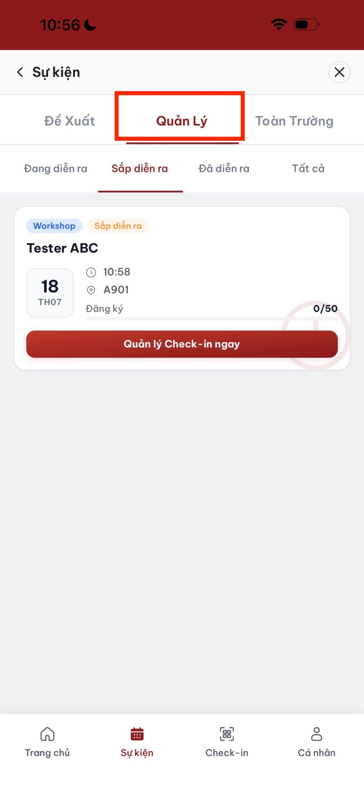
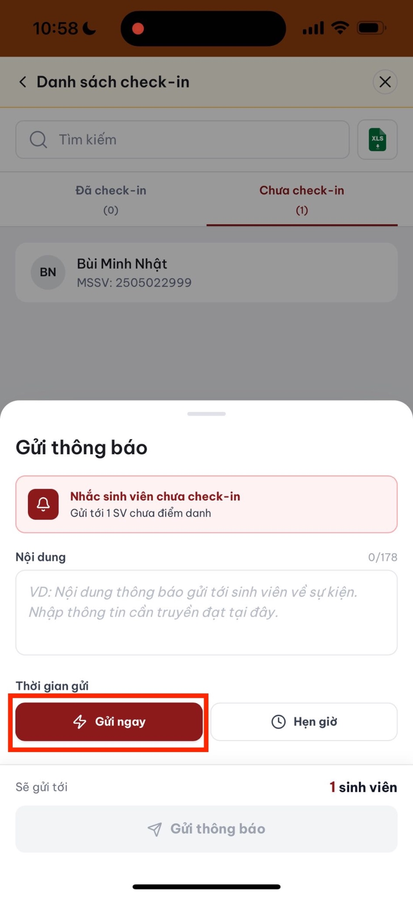
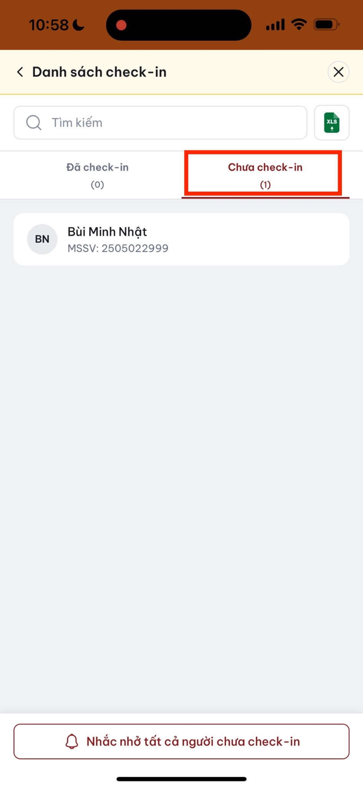

# Quản lý đăng ký

Trong khoảng thời gian từ khi sự kiện được duyệt đến trước giờ diễn ra, giảng viên chủ trì có thể theo dõi tình hình đăng ký.

## Xem danh sách đăng ký

1. Vào tab **Quản lý**.
2. Chọn sự kiện.
3. Mở mục **Đã đăng ký**.
4. Theo dõi tổng số và danh sách sinh viên theo thời gian đăng ký.

## Gửi thông báo

1. Trong chi tiết sự kiện, nhấn **Gửi thông báo**.
2. Soạn nội dung.
3. Gửi tới sinh viên đã đăng ký.

## Khuyến nghị vận hành

* Gửi nhắc trước sự kiện đủ sớm.
* Nêu rõ thời gian, địa điểm và phương thức check-in.
* Thông báo ngay khi có thay đổi hoặc hủy sự kiện.
