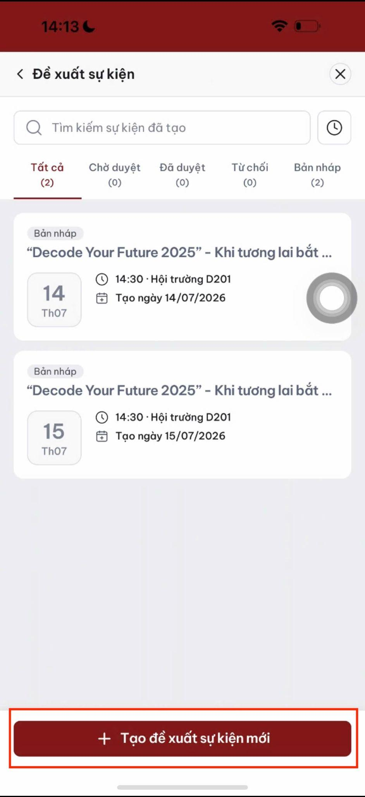
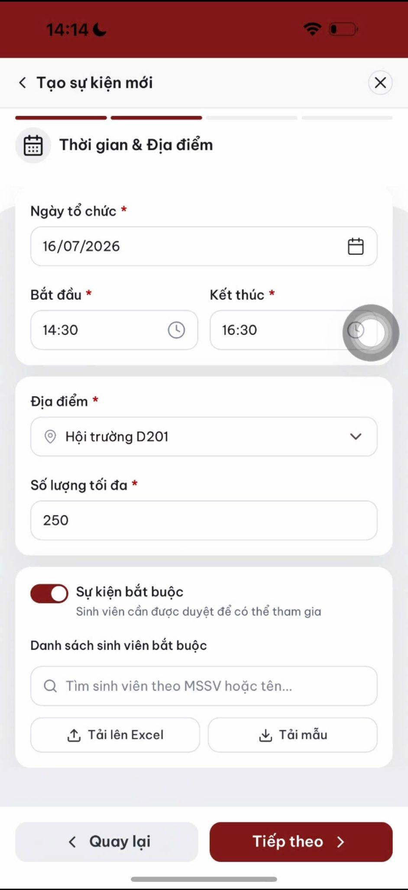
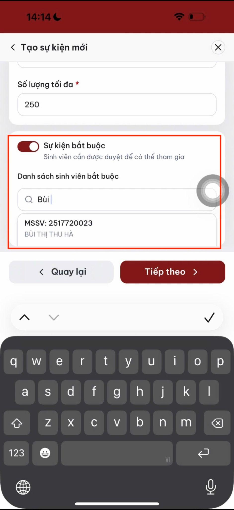
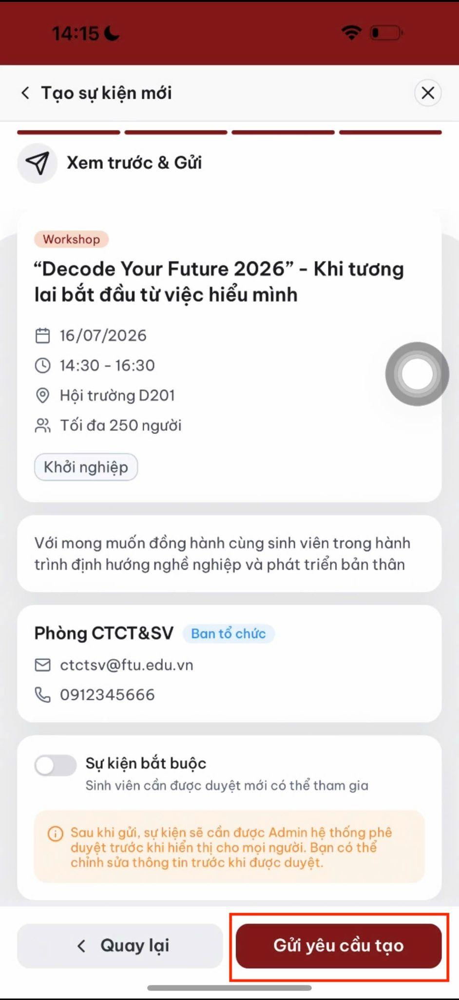
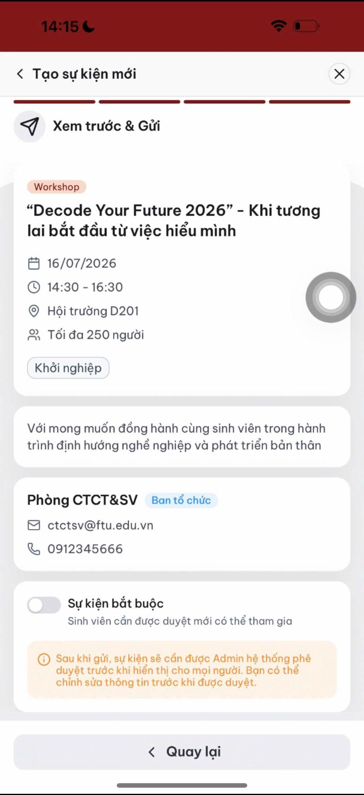
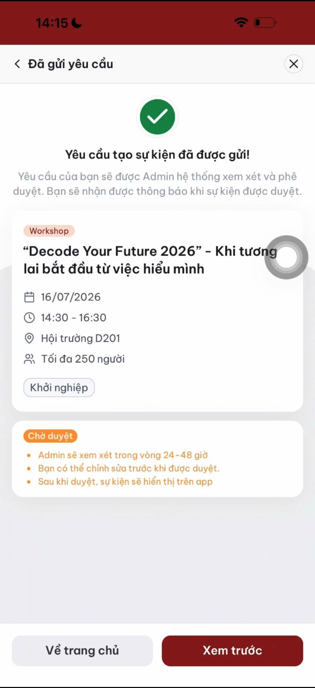

# Tạo và gửi duyệt sự kiện

Trang này dành cho giảng viên chủ trì.

## Phân loại sự kiện

| Loại             | Mô tả                                      | Quy tắc                      |
| ---------------- | ------------------------------------------ | ---------------------------- |
| Sự kiện thường   | Sinh viên tự nguyện đăng ký                | Có thể hủy trước giờ diễn ra |
| Sự kiện bắt buộc | Nhà trường yêu cầu nhóm sinh viên tham gia | Sinh viên không thể hủy      |

## Các bước tạo sự kiện

### 1. Mở biểu mẫu

Vào **Quản lý → + Tạo sự kiện**.

### 2. Điền thông tin

Nhập các trường chính:

* Tên sự kiện.
* Loại sự kiện.
* Đơn vị chủ trì.
* Thời gian bắt đầu và kết thúc.
* Địa điểm.
* Số lượng tối đa.

### 3. Chọn nhóm sinh viên được mời

Chỉ áp dụng với sự kiện bắt buộc. Có thể chọn theo khoa, năm học hoặc tải lên danh sách.

### 4. Gửi duyệt

Kiểm tra nội dung và nhấn **Gửi duyệt**.

### 5. Xem lại thông tin đã gửi

Mở lại sự kiện để kiểm tra trạng thái và nội dung.

### 6. Chờ kết quả duyệt

Sau khi được duyệt, sự kiện chuyển sang trạng thái mở đăng ký và xuất hiện trong tab **Khám phá** của sinh viên.

