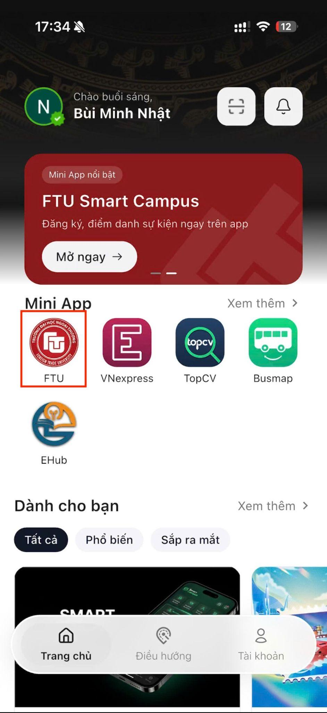
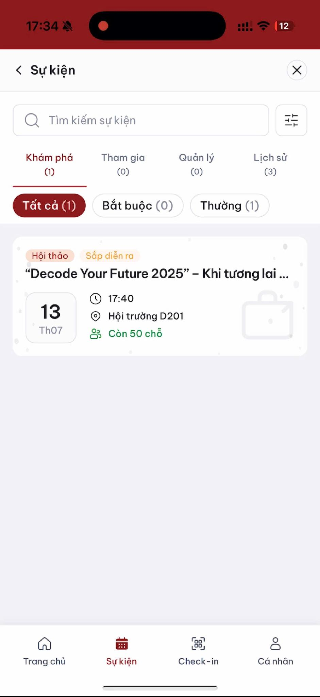
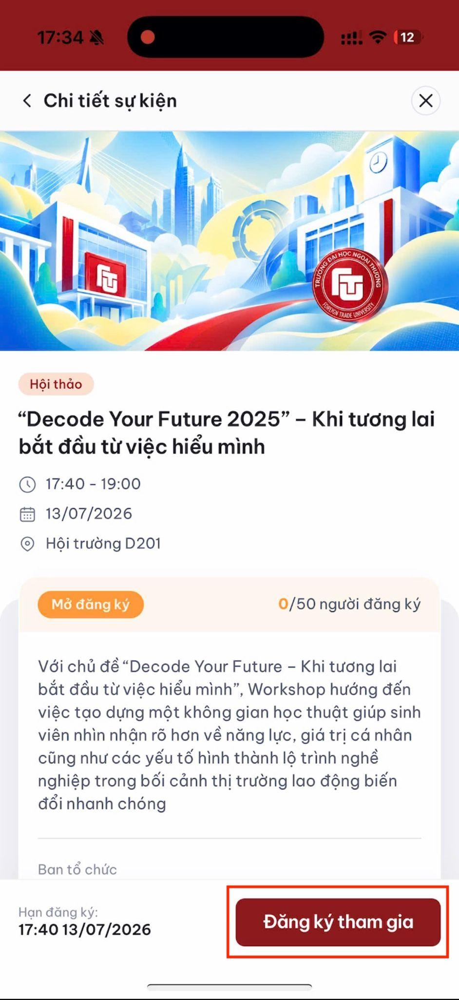
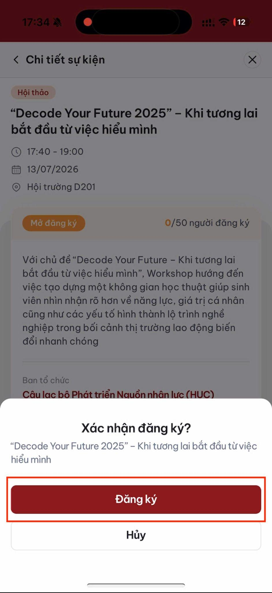
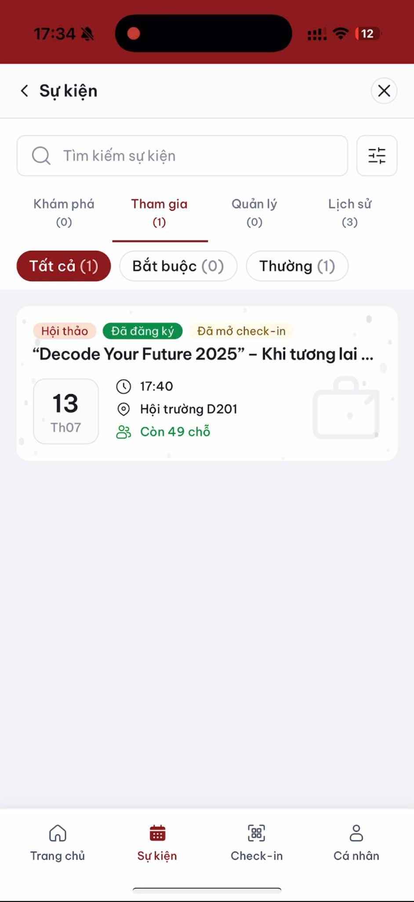

# Đăng ký và hủy đăng ký sự kiện

## Đăng ký sự kiện

1. Mở Mini App FTU.
2. Chạm **Sự kiện** trên thanh điều hướng, hoặc **Xem tất cả** tại khu vực sự kiện sắp tới.
3. Trong tab **Khám phá**, chọn sự kiện muốn tham gia.
4. Đọc thời gian, địa điểm và số lượng còn lại.
5. Chạm **Đăng ký tham gia**.
6. Chạm **Đăng ký** trong hộp thoại xác nhận.
7. Kiểm tra thông báo đăng ký thành công.

## Xem sự kiện đã đăng ký

Vào **Sự kiện → Tham gia**. Sự kiện đã đăng ký hiển thị nhãn tương ứng.

## Hủy đăng ký

Chỉ áp dụng với **sự kiện thường**:

1. Vào **Sự kiện → Tham gia**.
2. Chọn sự kiện.
3. Nhấn **Hủy đăng ký**.

> **Cảnh báo:** Sự kiện bắt buộc không thể hủy đăng ký. Nếu có lý do chính đáng không thể tham gia, hãy liên hệ trực tiếp giảng viên hoặc BTC.

## Chuẩn bị check-in

Đến ngày diễn ra, mở Mini App trước giờ bắt đầu khoảng 5-10 phút để có đủ thời gian chọn đúng sự kiện và thực hiện check-in.
