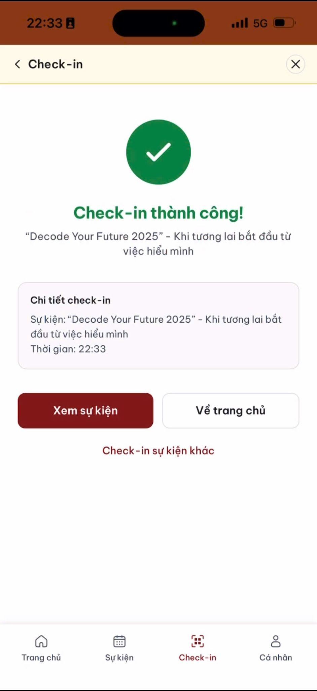
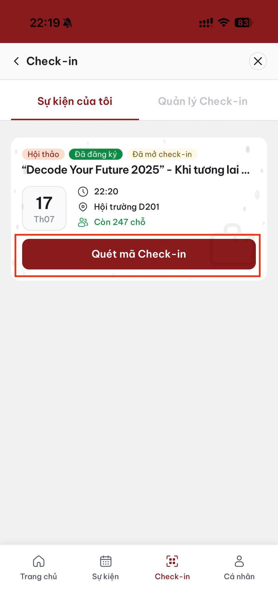
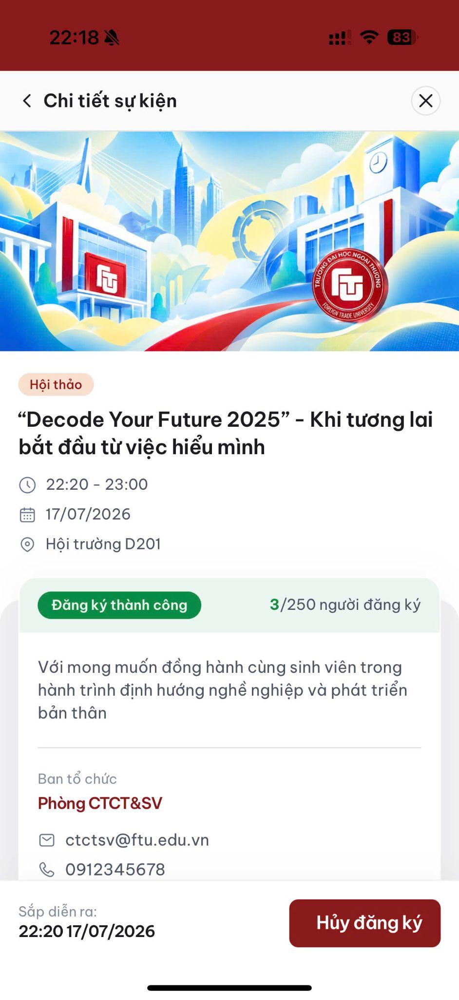
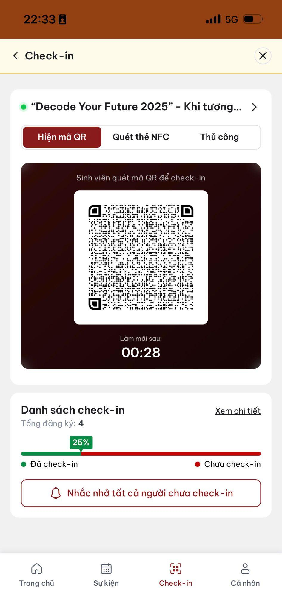
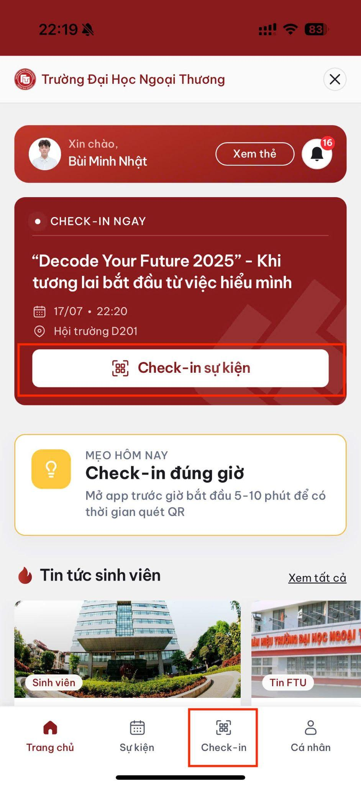

# Điểm danh tại sự kiện

## Tìm đúng sự kiện

1. Khi đến giờ sự kiện, mở tab **Check-in** hoặc chạm thẻ check-in trên Trang chủ.
2. Kiểm tra tên, thời gian và địa điểm.
3. Chạm **Quét mã Check-in**.

Giảng viên/BTC sẽ chỉ định một trong ba phương thức dưới đây.

## Cách 1: Quét mã QR

1. Giảng viên/BTC hiển thị mã QR.
2. Chọn **Quét mã QR** trên điện thoại.
3. Hướng camera vào mã QR.
4. Chờ thông báo **Check-in thành công**.

## Cách 2: Thẻ NFC

1. Mang theo thẻ sinh viên đã liên kết.
2. Đưa thẻ sát mặt sau điện thoại của giảng viên/BTC.
3. Chờ xác nhận đã check-in.

## Cách 3: Check-in thủ công

Dùng khi quên thẻ, không có điện thoại hoặc các phương thức khác không hoạt động:

1. Cung cấp họ tên và mã số sinh viên.
2. Giảng viên/BTC tìm và xác nhận trên ứng dụng.
3. Kiểm tra lại trạng thái sau đó.

> Nếu ứng dụng chưa cập nhật trạng thái ngay, chờ một lúc rồi tải lại. Nếu vẫn sai, báo cho giảng viên/BTC trước khi rời sự kiện.
