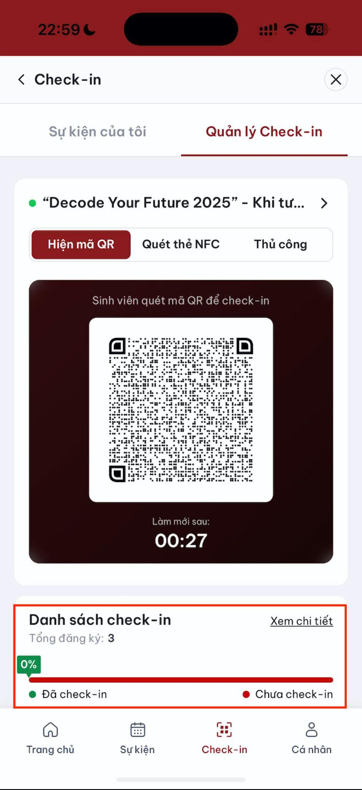
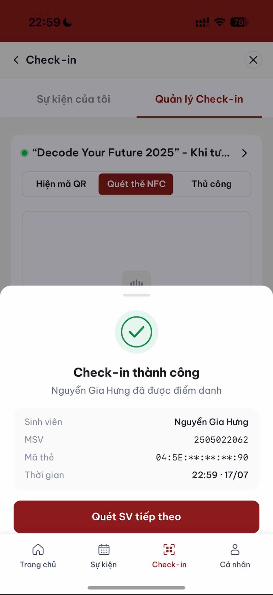
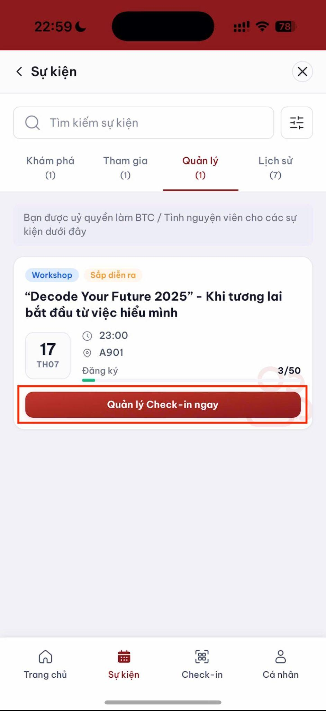

# Hỗ trợ BTC điểm danh

Trang này dành cho sinh viên được Ban tổ chức phân công hỗ trợ điểm danh.

## Hiển thị mã QR

1. Vào tab **Quản lý**.
2. Chọn sự kiện được phân công.
3. Mở chế độ hiển thị QR.
4. Đặt điện thoại ở vị trí dễ quét.
5. Theo dõi số lượt, tỷ lệ và danh sách check-in theo thời gian thực.

> Mã QR tự động thay đổi khoảng mỗi 30 giây.

## Quét thẻ NFC

1. Chuyển sang chế độ **Quét thẻ NFC**.
2. Yêu cầu sinh viên đưa thẻ sát mặt sau điện thoại.
3. Kiểm tra họ tên và MSSV hiển thị sau khi đọc thành công.

## Check-in thủ công

1. Nhập MSSV hoặc họ tên.
2. Chọn đúng sinh viên.
3. Xác nhận check-in.
4. Kiểm tra lượt vừa tạo trong danh sách **Đã check-in**.

