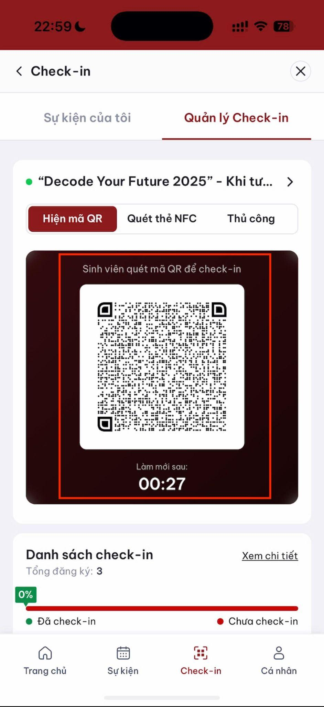
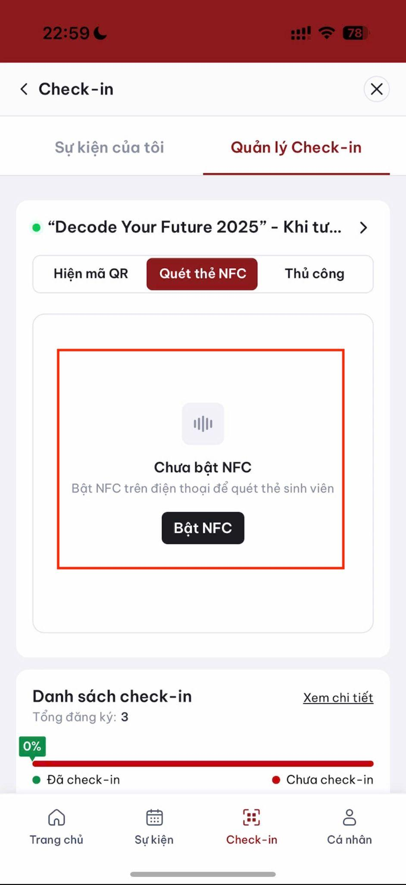
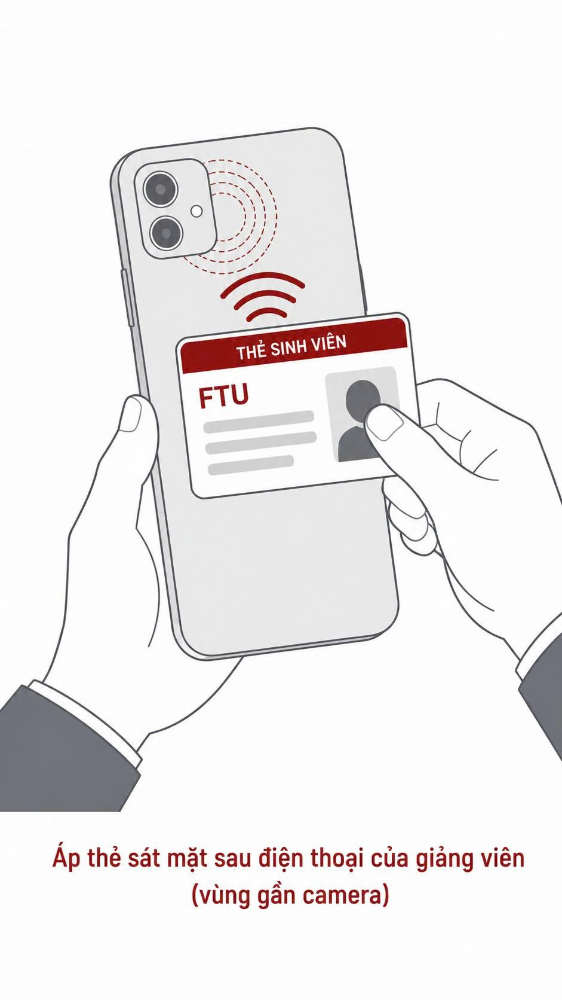
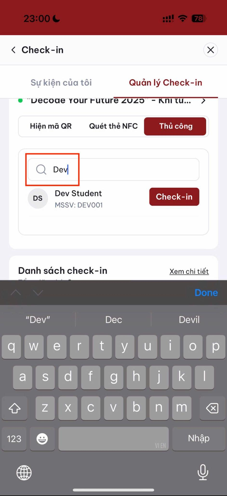
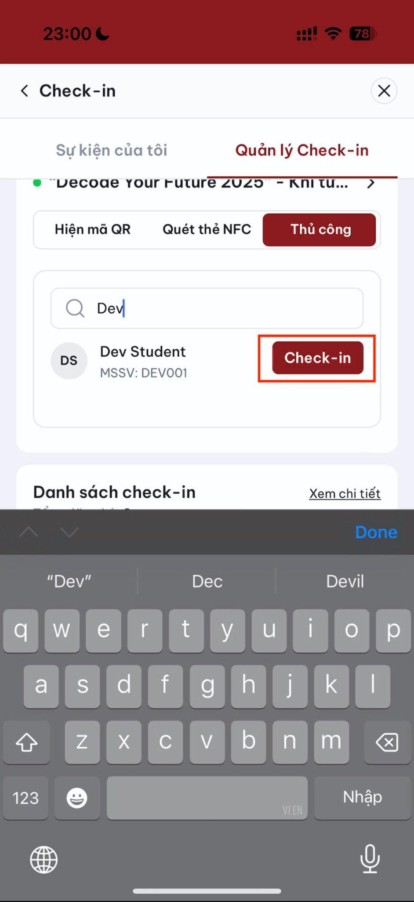
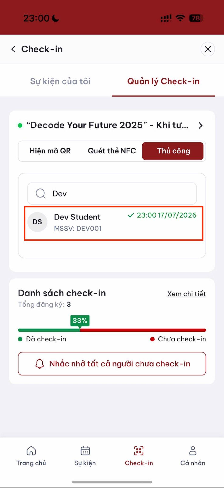

# Hỗ trợ BTC điểm danh

Trang này dành cho sinh viên được Ban tổ chức phân công hỗ trợ điểm danh.

## Hiển thị mã QR

1. Vào tab **Quản lý**.

2. Chọn sự kiện được phân công.
3. Mở chế độ hiển thị QR.

4. Đặt điện thoại ở vị trí dễ quét và quét mã QR. Màn hình hiển thị "Check-in thành công":

4. Theo dõi số lượt, tỷ lệ và danh sách check-in theo thời gian thực.

> Mã QR tự động thay đổi khoảng mỗi 30 giây.

## Quét thẻ NFC

1. Chuyển sang chế độ **Quét thẻ NFC**.

1. Yêu cầu sinh viên đưa thẻ sát mặt sau điện thoại.

3. Kiểm tra họ tên và MSSV hiển thị sau khi đọc thành công.

## Check-in thủ công

1. Nhập MSSV hoặc họ tên.

2. Chọn đúng sinh viên.
3. Xác nhận check-in.

4. Kiểm tra lượt vừa tạo trong danh sách **Đã check-in**.

