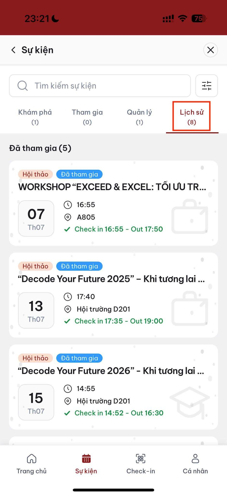
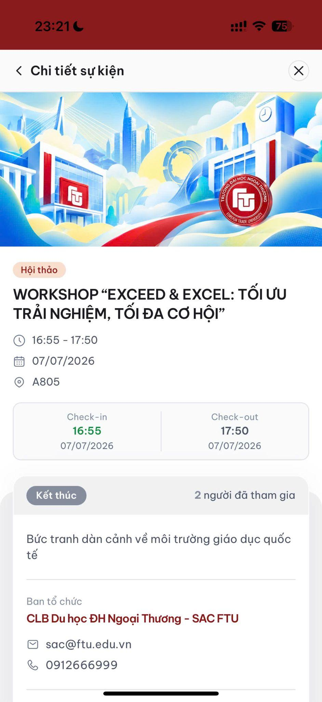
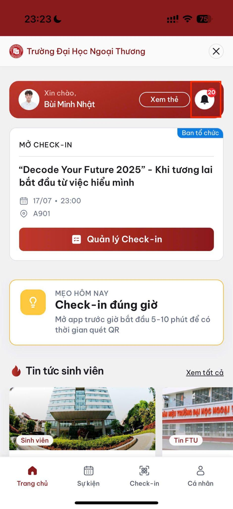

# Lịch sử tham gia và thông báo

## Xem lịch sử tham gia

1. Mở tab **Lịch sử** trong mục Sự kiện.

2. Chọn sự kiện đã kết thúc.
3. Xem thời gian check-in và phương thức đã sử dụng.

## Trạng thái tham gia

| Trạng thái  | Ý nghĩa                                                         |
| ----------- | --------------------------------------------------------------- |
| Đã tham gia | Bạn đã check-in thành công.                                     |
| Vắng mặt    | Đã đăng ký nhưng không check-in hoặc check-in không thành công. |

> Lịch sử tham gia có thể được Nhà trường sử dụng làm căn cứ tính điểm rèn luyện. Hãy kiểm tra ngay sau mỗi sự kiện. Nếu có sai lệch, liên hệ giảng viên/BTC trong vòng 3 ngày.

## Xem thông báo

Trung tâm thông báo có thể hiển thị:

* Đăng ký thành công.
* Nhắc sự kiện sắp diễn ra.
* Sự kiện thay đổi hoặc bị hủy.

 

