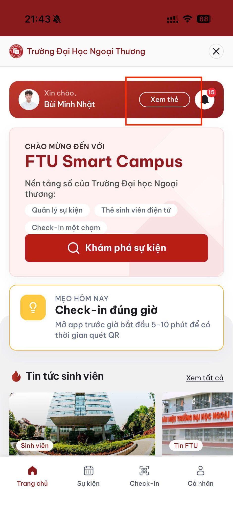
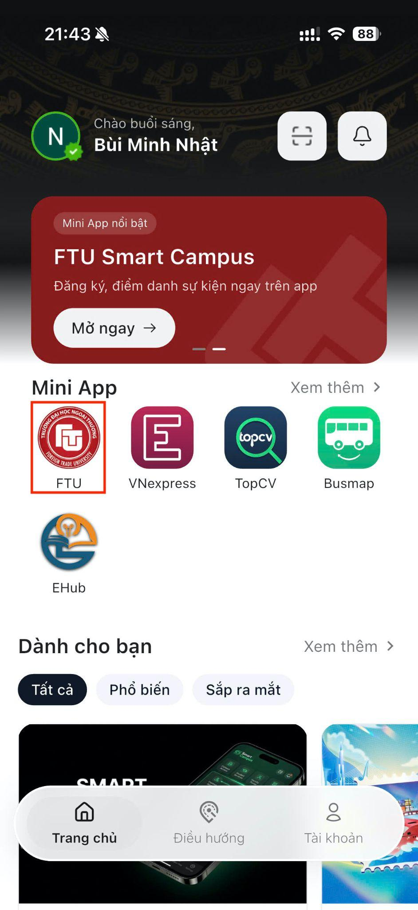
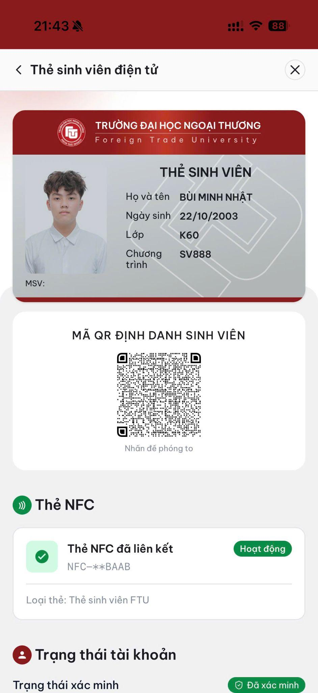

# Thẻ sinh viên số

## Xem thẻ

1. Tại Trang chủ 1Hub, mở Mini App FTU.
2. Tại Trang chủ Mini App, chạm **Xem thẻ** cạnh tên của bạn.
3. Kiểm tra thông tin trên thẻ.

## Thông tin hiển thị

Thẻ sinh viên số có thể bao gồm:

- Ảnh đại diện.
- Họ và tên.
- Mã số sinh viên.
- Khoa.
- Khóa học.
- Trạng thái xác minh.
- Mã QR định danh.

## Trạng thái thẻ

| Trạng thái | Ý nghĩa |
|---|---|
| Đang hoạt động | Thẻ hợp lệ, có thể sử dụng bình thường. |
| Chờ duyệt | Thông tin đang chờ Nhà trường xác nhận. |
| Tạm ngưng | Thẻ tạm thời không sử dụng được; cần liên hệ Phòng CTSV. |
